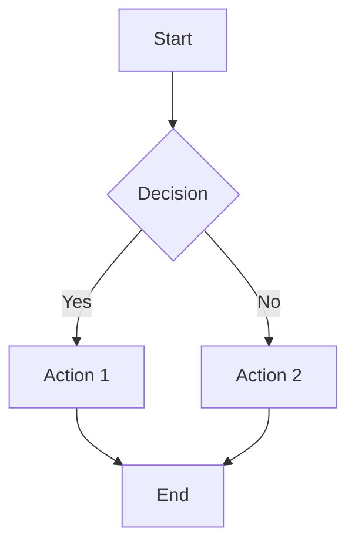

# Setup Instructions

## Quick Start

1. **Install Dependencies**
   ```bash
   npm install
   ```

2. **Build the Extension**
   ```bash
   npm run build
   ```

3. **Load in Chrome**
   - Open Chrome and go to `chrome://extensions/`
   - Enable "Developer mode" (toggle in top-right)
   - Click "Load unpacked"
   - Select the `dist` folder from this project

## Development

For development with auto-rebuild on file changes:

```bash
npm run dev
```

After making changes, reload the extension in Chrome:
- Go to `chrome://extensions/`
- Click the reload icon on the ChatGPTGraphs extension card

## Testing

### Test on ChatGPT

1. Go to https://chat.openai.com or https://chatgpt.com
2. Ask ChatGPT to create a Mermaid diagram, for example:
   ```
   Create a flowchart showing the process of making coffee
   ```
3. The extension should automatically detect and render the Mermaid code

### Test Mermaid Code

Try pasting this Mermaid code in a code block:



### Test Error Detection

Try this invalid Mermaid code to test error detection:

```mermaid
flowchart TD
    A[Start] -- B[End]
```

The extension should detect the incomplete arrow and offer to fix it.

## Icon Setup

The extension requires icon files. Place these in `extension/icons/`:
- `icon16.png` (16x16 pixels)
- `icon48.png` (48x48 pixels)
- `icon128.png` (128x128 pixels)

You can create simple placeholder icons or use an icon generator. The extension will work without icons, but Chrome will show a default icon.

## Troubleshooting

### Extension not working

1. Check the browser console for errors (F12)
2. Verify the extension is enabled in `chrome://extensions/`
3. Make sure you're on a supported page (ChatGPT or any page with Mermaid code)

### Build errors

1. Make sure all dependencies are installed: `npm install`
2. Check Node.js version (should be 16+)
3. Try deleting `node_modules` and `dist` folders, then reinstall:
   ```bash
   rm -rf node_modules dist
   npm install
   npm run build
   ```

### Graphs not rendering

1. Check browser console for Mermaid errors
2. Verify the Mermaid code is valid
3. Try refreshing the page

## File Structure

```
ChatGPTGraphs/
├── extension/           # Source files
│   ├── manifest.json
│   ├── contentScript.ts
│   ├── background.ts
│   ├── mermaidRenderer.ts
│   ├── errorDetector.ts
│   ├── utils.ts
│   ├── styles.css
│   └── icons/          # Icon files (add your icons here)
├── dist/               # Built extension (generated)
├── package.json
├── tsconfig.json
├── vite.config.ts
└── README.md
```
